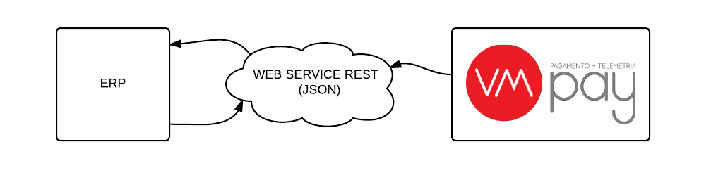

##########
Introdução
##########

Objetivo
========

Estabelecer a forma e conteúdo que serão disponibilizados para integração com
outros sistemas denominados ERPs.

Áreas envolvidas
================

* Departamento tecnologia

* Departamento comercial / comercial / representantes

* Suporte

Metodologia
===========

As informações disponibilizadas no sistema VMpay, consulta, cadastro, edição e
exclusão serão disponibilizadas por meio de um *web service* de forma que possam
ser capturadas e integradas em outro sistema.

O sistema de ERP será o agente "ativo", ou seja, cabe a ele proceder a busca
e/ou envio das informações requeridas, o sistema de Telemetria será o agente
"passivo", disponibiliza as informações, não realiza buscas ou envia.

As informações poderão ainda ser capturas por meio de planilhas eletrônicas,
limitando-se as planilhas disponibilizadas no sistema de Telemetria VMPay.

Elaboração
==========

As informações serão disponibilizadas pelo *web service* padrão *REST*,
dados trocado no formato JSON.

I. Comercial

  a. Sempre que houver uma previsão de integração o departamento Comercial
     deverá informar o cliente sobre o processo e forma de integração.

  b. O comercial deve enviar para a área de TI o nome do software ERP, os
     dados de contato Técnico para que a área de TI possa realizar as tratativas
     Técnicas;

II. T.I.

  a. Com base nas tratativas com a empresa “desenvolvedora” do produto
     a área de T.I determinará o prazo para disponibilização das informações;

  b. Se for necessário, a área de T.I desenvolverá um plano de trabalho antes da integração.

  c. Toda tratativa será documentada de forma a minimizar os erros de comunicação.

  d. Ilustração do processo

Conferência
===========

Após definição do processo de integração, o responsável pela área de T.I deverá
fazer uma conferência minuciosa de todos os dados.

Aprovação
=========

A aprovação é realizada pela Área de T.I e pela fornecedora/desenvolvedora do sistema ERP.

Envio
=====

Toda documentação será enviada por meio eletrônico.
